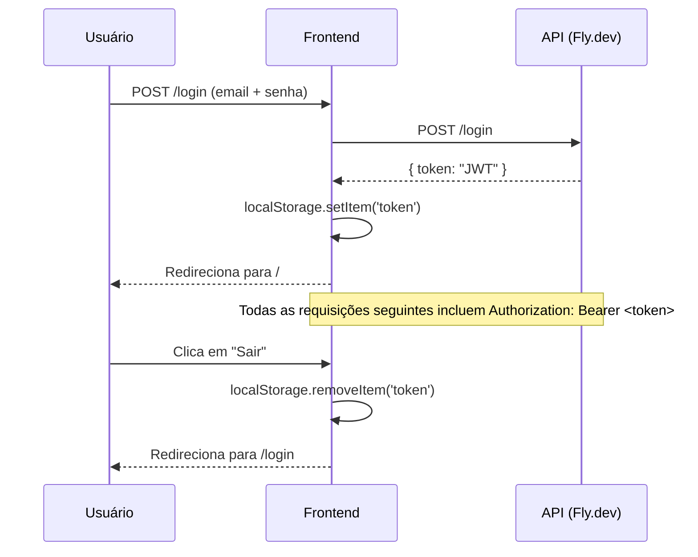
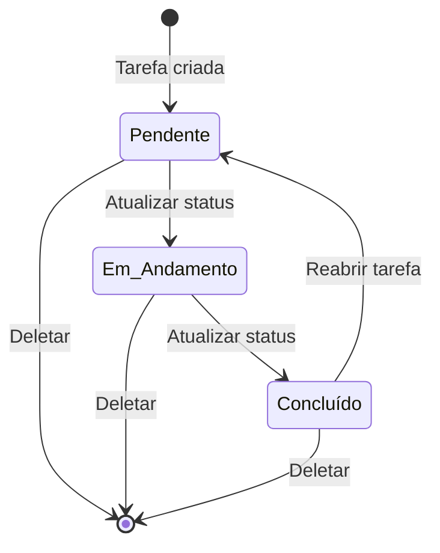
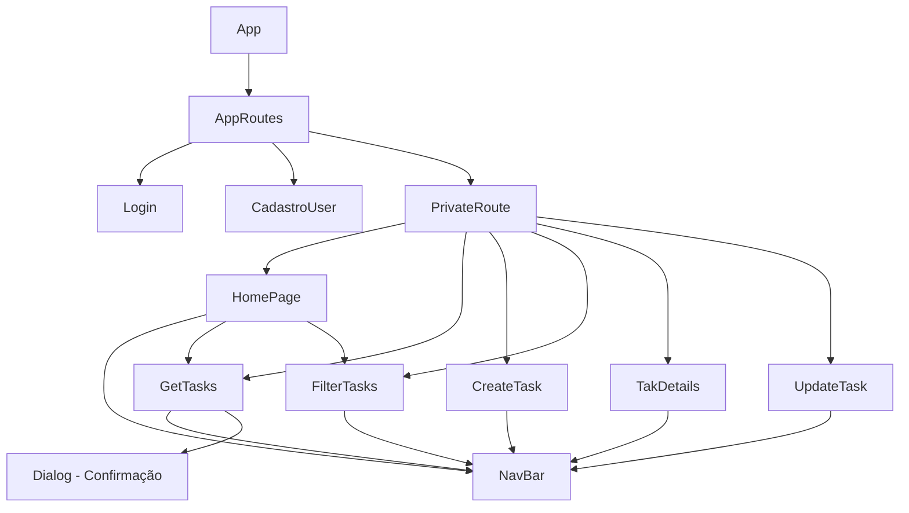

# DalyTaks 📋

Aplicação web para gerenciamento de tarefas do dia a dia. Permite criar, listar, filtrar, atualizar e deletar tarefas com autenticação por JWT.

---

## 🚀 Deploy

> **Frontend:** [https://dailytasks.vercel.app](https://dailytasks.vercel.app)  
> **API:** [https://daylytasks.fly.dev](https://daylytasks.fly.dev)

---

## 🛠️ Stack

| Tecnologia | Versão | Uso |
|---|---|---|
| React | 19 | UI |
| Vite | 8 | Bundler |
| TailwindCSS | 4 | Estilização utilitária |
| Material UI | 9 | Componentes de UI |
| TanStack Query | 4 | Gerenciamento de estado servidor |
| React Router DOM | 7 | Roteamento |
| Axios | 1 | HTTP client |

---

## 📁 Estrutura do projeto

```
src/
├── components/
│   ├── CadastroUser.jsx     # Formulário de cadastro de usuário
│   ├── FilterTasks.jsx      # Filtro e listagem de tarefas por critérios
│   ├── Header.jsx           # Wrapper do NavBar
│   ├── HomePage.jsx         # Página inicial (lista + filtro)
│   ├── Layout.jsx           # Layout base com header
│   ├── Login.jsx            # Página de login
│   ├── NavBar.jsx           # AppBar fixa com menu responsivo e logout
│   ├── PrivateRouter.jsx    # HOC de proteção de rotas
│   └── Dialog.jsx           # Modal de confirmação de exclusão
├── pages/
│   ├── TakDetails.jsx       # Detalhes de uma tarefa
│   ├── UpdateTask.jsx       # Editar tarefa existente
│   └── tasks/
│       ├── CreateTask.jsx   # Criar nova tarefa
│       └── GetTasks.jsx     # Listar todas as tarefas (cards)
├── routes/
│   └── AppRoutes.jsx        # Definição de rotas
├── services/
│   └── update-tesk.jsx      # getTaskById + updateTask
├── lib/
│   └── Api.jsx              # Instância Axios + interceptors JWT
├── App.jsx
├── App.css                  # @import tailwindcss + overflow-x fix
└── main.jsx
```

---

## 🗺️ Rotas

```mermaid
flowchart LR
    A([Usuário]) --> B{Autenticado?}
    B -- Não --> C[/login]
    B -- Não --> D[/registerUser]
    C --> E{Login OK?}
    E -- Sim --> F[PrivateRoute]
    D --> F

    F --> G[/ - HomePage]
    F --> H[/tasks - Lista de Tarefas]
    F --> I[/cadastrar - Criar Tarefa]
    F --> J[/tasks/filter - Filtrar Tarefas]
    F --> K[/tasks/:id - Detalhes]
    F --> L[/tasks/:id/update - Editar Tarefa]
```

---

## 🔐 Fluxo de Autenticação



---

## ✅ Funcionalidades

### Tarefas
- **Criar** tarefa com título, descrição, categoria, prioridade, status, data e hora
- **Listar** todas as tarefas em cards responsivos com chips de status/prioridade/categoria
- **Filtrar** por categoria, prioridade, status e/ou data
- **Ver detalhes** de uma tarefa específica
- **Editar** todos os campos de uma tarefa
- **Deletar** com modal de confirmação (sem exclusão acidental)
- **Alternar status** diretamente na listagem (pendente ↔ concluído)

### Usuários
- **Cadastro** com nome, e-mail, senha e confirmação de senha
- **Login** com e-mail e senha
- **Logout** com um clique na NavBar

---

## 🎨 Campos de uma Tarefa

| Campo | Tipo | Valores |
|---|---|---|
| `title` | texto | Obrigatório |
| `description` | texto | Opcional (mín. 4 caracteres) |
| `category` | select | `estudo`, `saude`, `trabalho`, `pessoal`, `outro` |
| `priority` | select | `alta` 🔴, `media` 🟡, `baixa` 🟢 |
| `status` | select | `pendente` ⏳, `em_andamento` 🔄, `concluido` ✅ |
| `date` | data | Formato `DD/MM/YYYY` |
| `time` | hora | Formato `HH:MM` |

---

## ⚙️ Como rodar localmente

```bash
# 1. Clone o repositório
git clone https://github.com/carlosribeiro25/dailytasks.git
cd dailytasks

# 2. Instale as dependências
npm install

# 3. Inicie o servidor de desenvolvimento
npm run dev
```

A aplicação estará disponível em `http://localhost:5173`.

---

## 🏗️ Build

```bash
npm run build
```

Os arquivos de produção são gerados na pasta `dist/`.

---

## 🔄 Ciclo de vida de uma Tarefa



---

## 📦 Componentes principais


